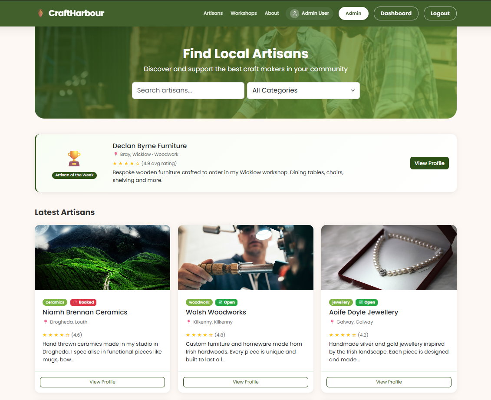
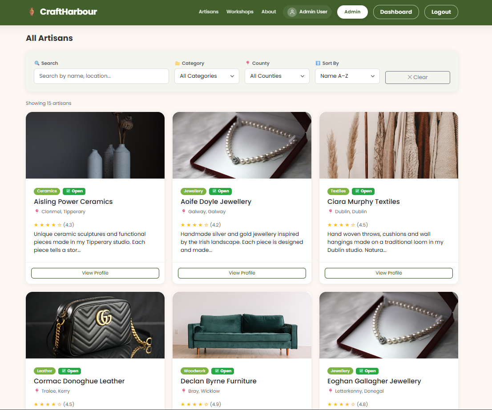
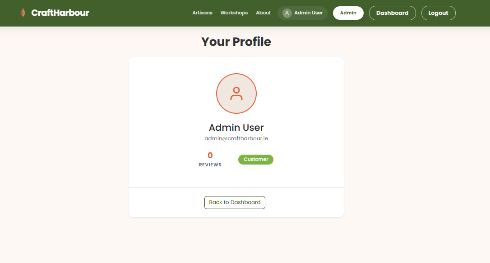
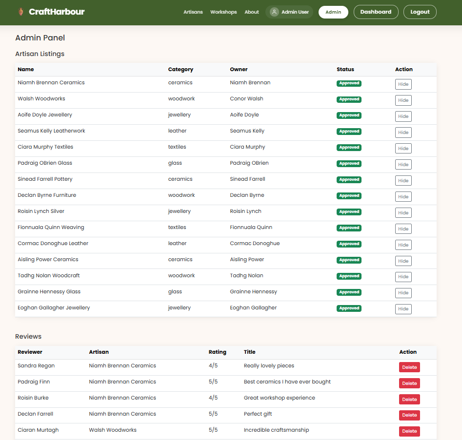
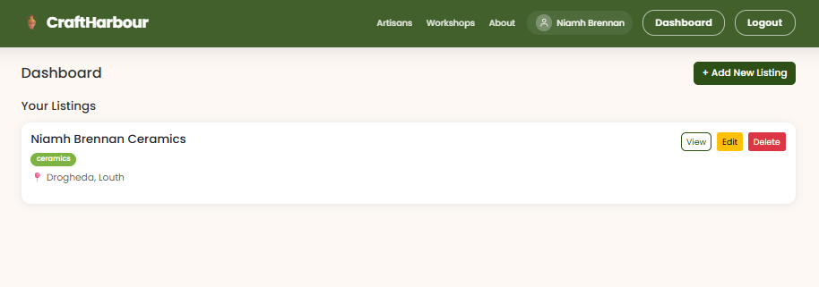

<p align="center">
  <h1 align="center">🏺 CraftHarbour</h1>
  <h3 align="center">Local Artisan & Maker Discovery Platform</h3>
</p>

<p align="center">
  <a href="https://laravel.com"></a>
  <a href="https://www.php.net"></a>
  
  
  
</p>

<p align="center">
  <strong>SD2A — Serban Moldovan, Luke McGloin, Gerard McGreevy</strong><br/>
  Server-Side Development CA2 — April 2026
</p>

---

# 📖 What is CraftHarbour?

CraftHarbour is a full-stack Laravel MVC web application built for our CA2 Server-Side Development module. The idea came from noticing that a lot of local craftspeople in Ireland have no real online presence — they rely on Instagram or word of mouth to get customers.

CraftHarbour gives artisans a proper space to showcase their work, advertise workshops, and connect with buyers in their local area. Buyers can browse artisans, filter by craft category and county, leave reviews, save their favourite makers, and book workshops.

---

# ✨ Features

## Core Features

- 🔐 User registration and login with **Google OAuth** support
- 👥 Four user roles — **Guest, Member, Artisan, Admin**
- 🏺 Full CRUD for **artisan listings** with cover image upload
- ⭐ Full CRUD for **reviews** with automatic average rating recalculation
- 🛠 Full CRUD for **workshop events**
- 🔍 Search artisans by name, keyword, or location
- 📂 Filter by craft category and county with **auto-submit dropdowns**
- 📄 Pagination on artisan listings
- 🏆 **Artisan of the Week** — highest rated artisan featured on home page
- 🛡 **Admin panel** — approve listings, delete reviews, manage user roles
- 📱 Responsive layout using Bootstrap 5

## Extra Features

- 🤝 **Favourite/Save artisans** — members can bookmark artisans to their dashboard
- 🟢 **Availability status** — artisans can toggle Open for Commissions / Fully Booked
- 🔗 **Share listing** — copy link and WhatsApp share button on every artisan profile
- 🕐 **Recently viewed artisans** — last visited artisans shown at bottom of page
- 🖼 **Portfolio gallery** — artisans can upload multiple portfolio images with lightbox view
- 📅 **Workshop booking** — Book a Spot button with live capacity tracking
- 👍 **Review helpfulness voting** — members can upvote reviews, most helpful shown first
- ⏳ **Workshop waitlist** — join a waitlist when a workshop is full

---

# 🖥 Screenshots

### Home Page


### Artisan Directory


### Artisan Profile


### Admin Panel


### Member Dashboard


---

# 🗄 Database Schema

| Table | Key Columns |
|-------|-------------|
| users | id, name, email, password, role, google_id |
| artisans | id, user_id, name, category, bio, town, county, cover_image, avg_rating, is_approved, availability_status |
| reviews | id, user_id, artisan_id, rating, title, body, is_flagged |
| workshops | id, artisan_id, title, description, date, start_time, price, max_capacity |
| portfolio_images | id, artisan_id, image_path, caption, sort_order |
| favourites | id, user_id, artisan_id |
| workshop_bookings | id, user_id, workshop_id |
| review_votes | id, user_id, review_id |

---

# 👤 User Roles

| Role | Permissions |
|------|-------------|
| Guest | Browse artisans, view profiles, read reviews |
| Member | All guest permissions + leave reviews, save artisans, book workshops |
| Artisan | All member permissions + create/edit/delete own listing, manage workshops, toggle availability |
| Admin | Full access — approve listings, delete reviews, manage user roles |

---

# 🚀 Setup Instructions

**Requirements:** PHP 8.5, Composer, Node.js

```bash
git clone https://github.com/serbanfojc/CA2-Laravel-CraftHarbour
cd CA2-Laravel-CraftHarbour
composer install
npm install
cp .env.example .env
php artisan key:generate
php artisan migrate --seed
php artisan storage:link
php artisan serve
```

Visit `http://localhost:8000`

---

# 🔑 Test Accounts

| Email | Password | Role |
|-------|----------|------|
| admin@craftharbour.ie | password | Admin |
| niamh@craftharbour.ie | password | Artisan (has listing) |
| conor@craftharbour.ie | password | Artisan (has listing) |
| ciaran@craftharbour.ie | password | Member |
| sandra@craftharbour.ie | password | Member |

---

# 🛠 Tech Stack

| Layer | Technology |
|-------|------------|
| Framework | Laravel 13 |
| Language | PHP 8.5 |
| Database | SQLite |
| Auth | Laravel Fortify + Livewire Flux |
| Social Login | Laravel Socialite (Google) |
| Frontend | Bootstrap 5, Poppins font |
| Version Control | Git / GitHub |

---

# 📁 Git Workflow

Each feature is developed on its own branch and merged into `cleanmain` when complete:

```
cleanmain
├── feature/auto-filter-security-fixes
├── feature/share-listing
├── feature/availability-status
├── feature/favourite-artisans
├── feature/recently-viewed
├── feature/portfolio-gallery
├── feature/workshop-booking
├── feature/review-helpfulness
└── feature/workshop-waitlist
```

---

---

# 🎬 Demo

> Video walkthrough coming soon

---

# 👨‍💻 Authors

<p align="center">
  <a href="https://www.linkedin.com/in/serban-moldovan-66a212329/">
    
  </a>
</p>
